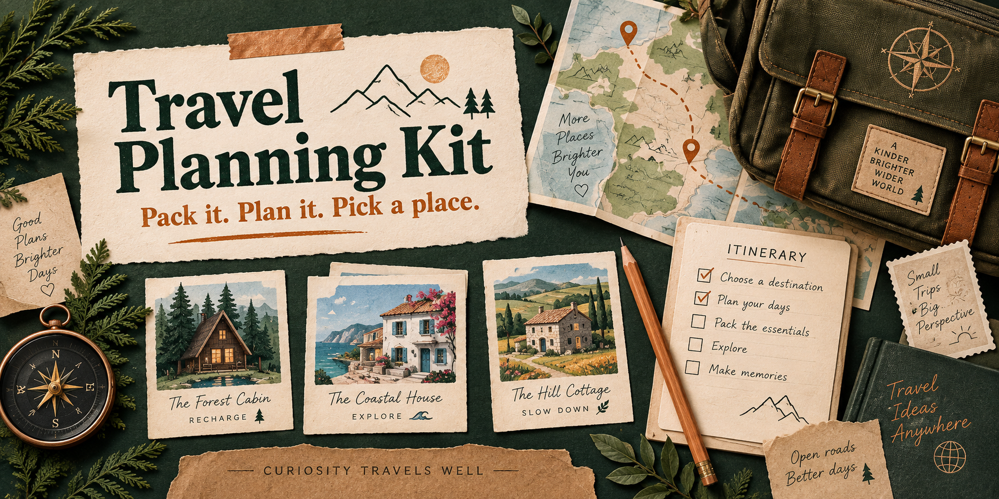

# Travel Planning Kit



**A packing list you can actually use. A plan everyone can follow. A better way to compare places to stay.**

I built this for me and my personal use. It keeps the thinking behind a trip together: what to bring, what still needs deciding, and why one rental might work better than another.

Make it your own, and feel free to improve mine. Hopefully it gives you a useful starting point, or at the very least some ideas. Cheers!

> **Start here:** [Download the examples](https://github.com/jessecmaddox3/travel-planning-kit/releases/download/v1.0.0/travel-planning-kit-1.0.0-demo.zip), unzip the folder, and open **Start.html**. No installation or account needed to explore and print them. To make your own trip with ordinary form fields, follow the setup below.

## Four things from one trip

The kit keeps the practical details and the reasons behind your choices. The same saved trip produces all four documents, so you can update a quote or date once and make a fresh version.

| Make | What it includes |
| --- | --- |
| Packing checklist | Reusable catalog, trip tags, manual choices, quantities, who packs what, and a prominent morning-of-departure check. Two columns on paper. |
| Trip plan | Summary, current status, daily anchors and backups, decisions with owners and urgency, activities, preferences, sources, and lessons for next time. |
| Illustrated rental comparison | Photo strips, ranked shortlist, expandable alternatives, rejected options, sleeping arrangements, practical details, quoted dates, fees and exact household splits. |
| Full rental table | All 22 comparison fields on screen, with grouped landscape tables for legible printing. |

The included trip, places, prices and property images are entirely invented. Nothing here is a recommendation for a real destination or listing.

## Make it yours

You need a desktop computer and **Python 3.11 or newer** to run the editor. Python is a free program that runs this kit. You do not need to write code, create a GitHub account, install extra Python packages, or subscribe to an AI service.

1. Install Python from [python.org/downloads](https://www.python.org/downloads/). Use the current stable version for your computer. Official installation help is available for [Mac](https://docs.python.org/3/using/mac.html) and [Windows](https://docs.python.org/3/using/windows.html).
2. [Download the full kit](https://github.com/jessecmaddox3/travel-planning-kit/releases/download/v1.0.0/travel-planning-kit-1.0.0-source.zip). Unzip it into a folder you can find again, such as Documents. Keep the files together.
3. **Mac:** double-click `Start on Mac.command`. **Windows:** double-click `Start on Windows.cmd`. Keep the window it opens running while you use the editor. If the launcher cannot start, the [setup guide](docs/SETUP.md) walks through the terminal fallback.
4. Your browser opens the fictional example. Choose **Start a new trip**, enter arrival and departure, then work through **Packing**, **The plan**, and **Places to stay**. The reusable packing catalog stays available.
5. Click **Save my trip**. Your browser downloads an editable `my-trip.json` file. Keep it somewhere private. Next time, choose **Open saved trip** and select that file.
6. Choose a document and click **Update preview** or **Download HTML**. Open the downloaded HTML in your browser to print or share it. Browser print dialogs also offer a PDF destination. Review the pages before sharing.

**Save before closing the tab.** Changes stay in the current tab until you download a saved copy. Refreshing or closing it can lose unsaved changes. Exported HTML is a finished document; the JSON file is what you reopen to edit the trip. The editor never overwrites your original file.

## Photos, prices and research

Local PNG, JPEG and WebP images can be embedded into the rental gallery, so the result works offline. Image paths are relative to the configuration folder selected when starting the editor. The [photo guide](docs/PHOTOS.md) explains how to use your own folder, collect public listing photo URLs, and apply them to matching properties. Remote images stay as links unless you explicitly enable them on the command line.

Prices distinguish exact totals, ranges and unknowns. Exact splits allocate every cent, including a one-cent remainder. Quoted stay dates, check dates and fee scope stay visible. Different dates are flagged; availability remains unknown until you supply it. The kit does not check live prices, reserve a property, send invitations or make bookings.

The [research templates](templates/) and [optional AI skill](skills/travel-planning/SKILL.md) help collect requirements, compare sources, keep a decision record and review the trip afterward. The kit itself uses no AI tokens. You can do the research yourself or use an assistant you already have.

## For people who like commands

Run these from the unzipped kit folder. On Windows, use `py` in place of `python3`.

```sh
python3 -m travel_kit start
python3 -m travel_kit demo --output output/example
python3 -m travel_kit packing --config travel_kit/example/cedar-bay.json --output output/packing.html
python3 -m travel_kit plan --config travel_kit/example/cedar-bay.json --output output/plan.html
python3 -m travel_kit compare --config travel_kit/example/cedar-bay.json --output output/rentals.html
python3 -m travel_kit table --config travel_kit/example/cedar-bay.json --output output/comparison.html
```

Existing output files are protected. Choose a new filename, or add `--overwrite` when you intend to replace one. The editor, command line and demo use the same rendering code. See [the input format](docs/FORMAT.md), [design notes](docs/DESIGN.md) and [development guide](CONTRIBUTING.md).

## Keep your own trip private

The editor runs on your computer and listens only on `127.0.0.1`. Ordinary editing, rendering and demo generation make no external requests. Photo fetching, enabling external images, and following a source link are explicit network actions. There is no analytics, account, cloud save or shared backend.

Your saved JSON, exported HTML/PDF and embedded photos contain whatever you put in them. Keep those out of public repositories and review them before sharing. The supplied examples and release files contain only fictional content. See [security and privacy](SECURITY.md).

## Use it freely

[MIT licensed](LICENSE): use it, change it, share it, or build something else from it. Keep the license notice with redistributed code. Your own data remains yours; third-party listing photos and text keep their original rights. [Asset notes](docs/ASSETS.md) identify the generated illustrations shipped here.

Ideas, fixes and improvements are welcome. Please use fictional examples in issues and contributions.
